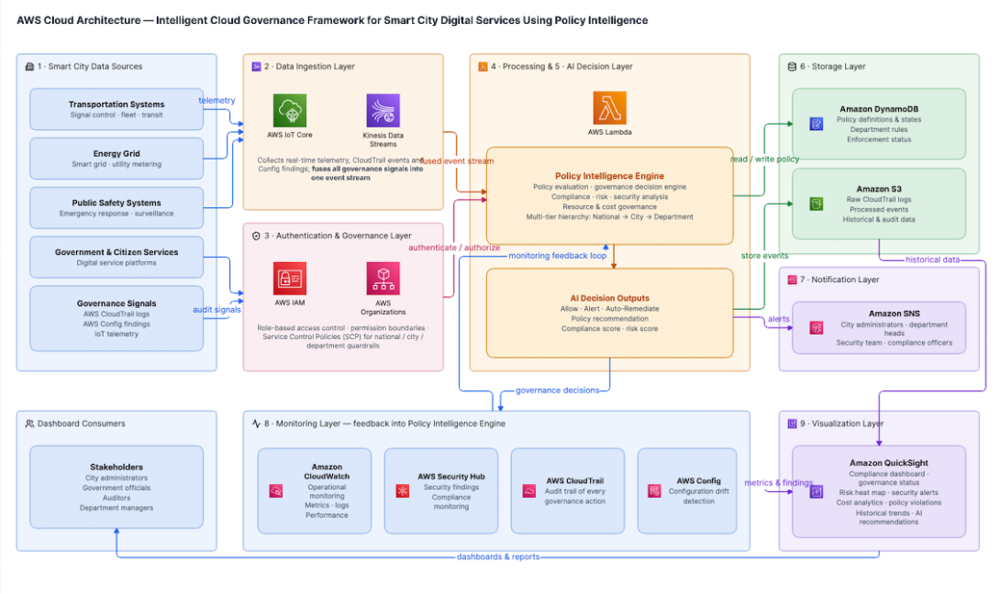
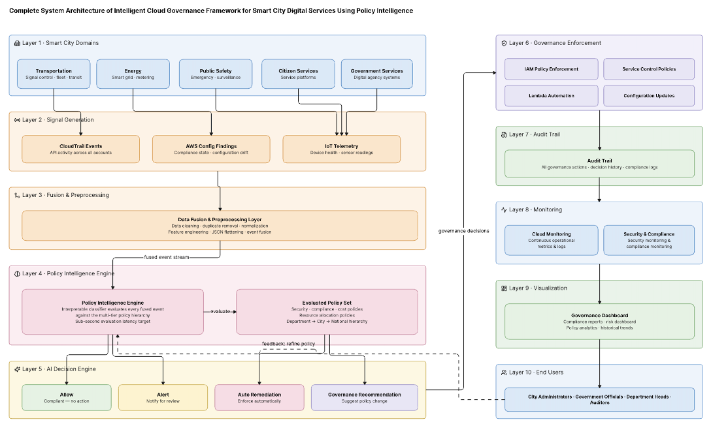

# Project Title

Intelligent Cloud Governance Framework for Smart City Digital Services using Policy Intelligence

# Team Members

Aditya Upadhye 24BIT0274
Aman Singh Sachan 24BIT0292
Aditya Jain 24BIT0333

# Objective

1. Design and implement a centralized policy-intelligence engine on AWS that ingests governance signals — AWS CloudTrail logs, AWS Config findings, and IoT telemetry — from smart-city digital services and evaluates them against defined policies in real time.

2. Achieve automated, closed-loop policy enforcement (not just detection) across at least three representative smart-city service domains — e.g., transportation, energy, and public safety — using AWS-native tools (IAM, Config, Organizations, Lambda) to take proportionate action (allow / alert / auto-remediate) rather than passive alerts.

3. Reduce manual governance-review effort by automating at least 70% of routine compliance and audit checks that currently require human verification.

4. Deliver interpretable, plain-language policy decisions for non-technical municipal stakeholders, with near real-time (sub-second) policy-evaluation latency, so governance actions are explainable and not a "black box."

5. Implement secure, role-based multi-department policy management — mirroring a national/city/department governance hierarchy — to preserve data privacy and compliance across city agencies.

6. Provide a centralized dashboard (Amazon QuickSight) visualising governance status and policy compliance across all connected services, supporting transparent, data-driven decisions for city administrators.

# Proposed Architecture / Framework

The proposed framework follows an event-driven, cloud-native architecture built entirely on AWS.
Diagram 1 — AWS Cloud Architecture
Figure 1 illustrates the AWS cloud deployment of the proposed framework. Data from smart city domains such as transportation, energy, public safety, and government services, along with AWS CloudTrail, AWS Config, and IoT telemetry, is collected through AWS IoT Core and Amazon Kinesis. The Policy Intelligence Engine, implemented using AWS Lambda, evaluates governance policies and generates automated decisions. AWS IAM and AWS Organizations provide secure access control, while Amazon S3 and DynamoDB store governance data. Monitoring, notifications, and dashboards are handled through CloudWatch, Security Hub, SNS, and QuickSight, ensuring real-time, secure, and scalable cloud governance.

Figure 1: AWS Cloud Architecture — Intelligent Cloud Governance Framework for Smart City Digital Services Using Policy Intelligence

Diagram 2 — Complete System Architecture
Figure 2 presents the end-to-end workflow of the proposed system. Governance signals from CloudTrail, Config, and IoT devices are collected and preprocessed before being analyzed by the AI-based Policy Intelligence Engine. The engine evaluates events against multi-level governance policies and generates decisions such as Allow, Alert, Auto-Remediation, or Governance Recommendation. These decisions are enforced through IAM policies, Service Control Policies, Lambda automation, and configuration updates. All actions are recorded, continuously monitored, and displayed on governance dashboards, providing transparent, auditable, and automated policy management for smart city administrators.
 
Figure 2: Complete System Architecture of Intelligent Cloud Governance Framework for Smart City Digital Services Using Policy Intelligence

### Workflow

1. Smart city applications generate operational events.
2. AWS CloudTrail, AWS Config, and IoT devices continuously produce governance signals.
3. AWS IoT Core and Amazon Kinesis ingest and stream the data.
4. A Policy Intelligence Engine (AWS Lambda + AI logic) evaluates incoming events against predefined governance policies.
5. Based on policy evaluation, the framework performs one of the following:
   - Allow request
   - Generate alert
   - Auto-remediate the issue
   - Recommend governance action
6. IAM, AWS Organizations, and AWS Config enforce governance policies.
7. Amazon S3 and DynamoDB store governance logs and policy information.
8. CloudWatch, Security Hub, SNS, and QuickSight provide monitoring, notifications, and visualization.

# Technology Stack

## Cloud Platform

- Amazon Web Services (AWS)

# AWS Services Used

The framework is built natively on AWS, mapping each layer of the proposed architecture (Fig. 1 and Fig. 2) to a specific managed AWS service. This keeps governance logic *"in the cloud, of the cloud"* rather than bolted on afterward, and gives every automated decision a traceable, auditable service-level origin.

| AWS Service | Architecture Layer | Role in the Framework |
|-------------|--------------------|-----------------------|
| **AWS IoT Core** | Data Ingestion | Ingests real-time telemetry from transportation, energy-grid, and public-safety IoT devices. |
| **Amazon Kinesis Data Streams** | Data Ingestion | Streams and buffers CloudTrail, Config, and IoT events into a unified, ordered event pipeline. |
| **AWS IAM (including Permission Boundaries)** | Authentication & Governance | Implements role-based access control and department-level permission boundaries. |
| **AWS Organizations (Service Control Policies)** | Authentication & Governance | Enforces city-wide governance guardrails across multiple AWS accounts using Service Control Policies (SCPs). |
| **AWS Lambda** | Processing & AI Decision | Hosts the Policy Intelligence Engine and executes automated governance decisions and remediation actions. |
| **Amazon DynamoDB** | Storage | Stores governance policies, department rules, and real-time enforcement status. |
| **Amazon S3** | Storage | Stores raw CloudTrail logs, processed events, datasets, and historical audit records. |
| **Amazon SNS** | Notification | Sends governance alerts and notifications to city administrators, department heads, and security teams. |
| **Amazon CloudWatch** | Monitoring | Collects operational metrics, application logs, and monitors overall system performance. |
| **AWS Security Hub** | Monitoring | Aggregates security findings and continuously monitors compliance across AWS services. |
| **AWS CloudTrail** | Monitoring / Signal Source | Records every AWS API call and provides the primary audit trail and governance event source. |
| **AWS Config** | Monitoring / Signal Source | Detects configuration drift and provides continuous compliance-state evaluations. |
| **Amazon QuickSight** | Visualization | Provides centralized governance dashboards including compliance status, security alerts, cost analytics, policy violations, and historical trends. |

## AI & Analytics

- Policy Intelligence Engine
- Explainable AI-based Policy Evaluation
- Cloud Governance Analytics

## Programming & Data

- Python
- JSON
- AWS SDK (Boto3)

# Dataset Details

Phase 1 uses a real, publicly released AWS CloudTrail dataset to develop and evaluate the security-related detection component of the policy-intelligence engine—the same event source referenced in the review of Paper 12. Its details are summarized below.

| Field | Detail |
|--------|--------|
| **Dataset Name** | AWS CloudTrail Logs Dataset (from flaws.cloud) |
| **Source** | Scott Piper / Summit Route — publicly released for AWS security research; also mirrored on Kaggle |
| **URL** | https://summitroute.com/downloads/flaws_cloudtrail_logs.tar (mirror: https://www.kaggle.com/datasets/nobukim/aws-cloudtrails-dataset-from-flaws-cloud) |
| **Size** | Approximately **240 MB** compressed, distributed as gzipped JSON chunks of **100,000 events** each |
| **Number of Records** | **1,939,207** CloudTrail events spanning **2017-02-12** to **2020-10-07** |
| **Number of Features** | Approximately **20** top-level CloudTrail fields (*eventTime, eventSource, eventName, awsRegion, sourceIPAddress, userAgent, errorCode, requestParameters, responseElements, resources*, etc.), several of which contain nested JSON objects such as **userIdentity** and **sessionContext** |
| **Data Type** | Semi-structured JSON event logs containing categorical, timestamp, and nested text-based fields |
| **License / Usage Terms** | Released publicly by the author for security research. IP addresses, account IDs, and access keys are anonymized. No formal open-source license is attached; therefore, the dataset is used only for non-commercial academic research. |
| **Purpose of Using the Dataset** | Train and evaluate the classifier that detects anomalous authentication, privilege-escalation, and reconnaissance patterns, serving as the security-domain input to the policy-intelligence engine. |
| **Preprocessing Required** | Flatten nested JSON fields (*userIdentity*, *requestParameters*); encode categorical attributes (*eventName*, *eventSource*, *awsRegion*); derive temporal features from *eventTime*; remove duplicate API calls; and generate malicious/benign labels using known **flaws.cloud** attack levels and associated IP/user-agent indicators. |

AWS Config findings and IoT telemetry—the other two governance signal sources in the proposed framework—do not currently have an equivalent publicly available combined dataset. Therefore, **Phase 2** will generate a synthetic AWS Config and IoT telemetry dataset based on real AWS Config rule outputs and representative smart-city sensor schemas, enabling end-to-end fusion of all three governance signals.
